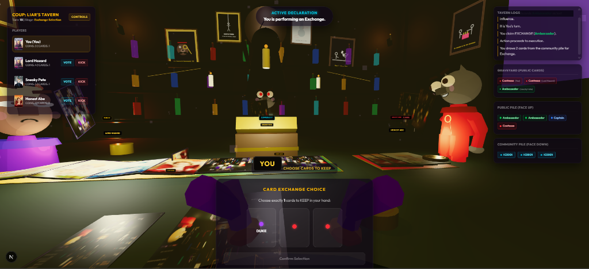
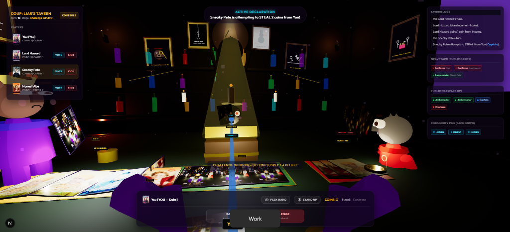
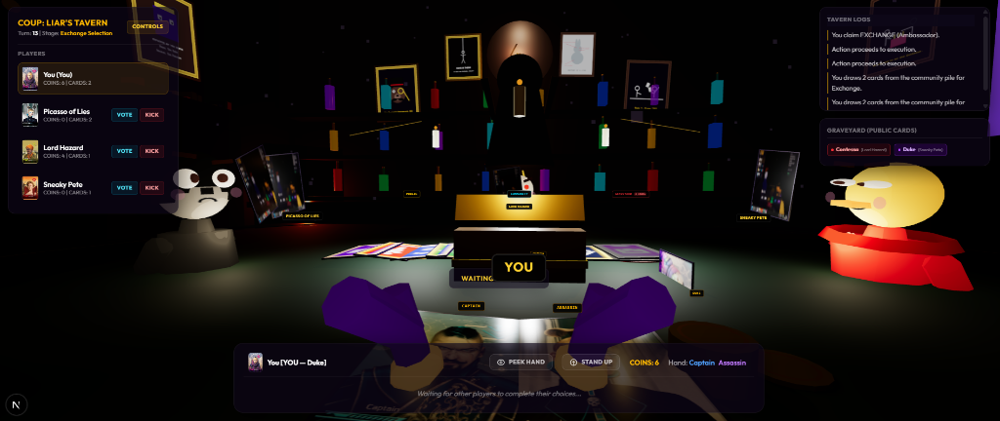
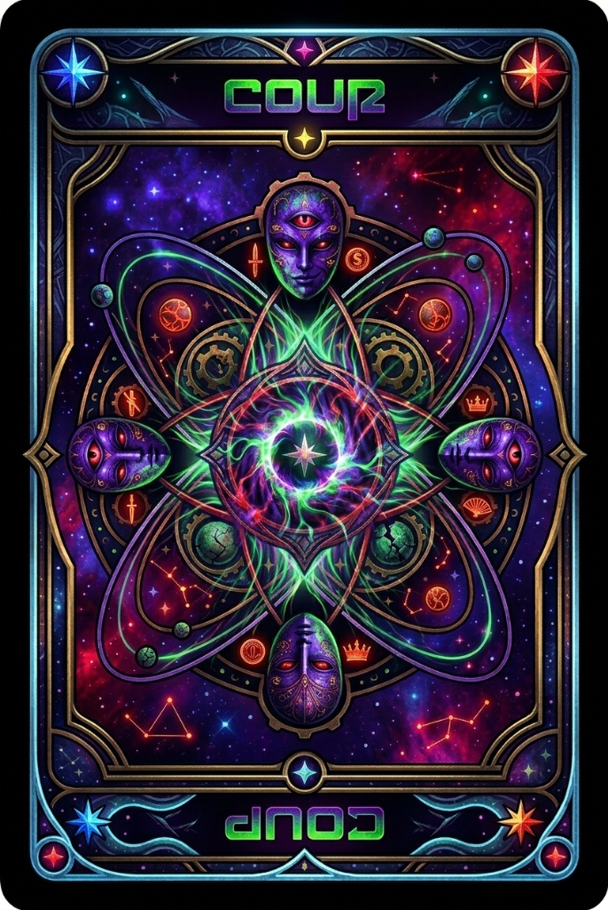
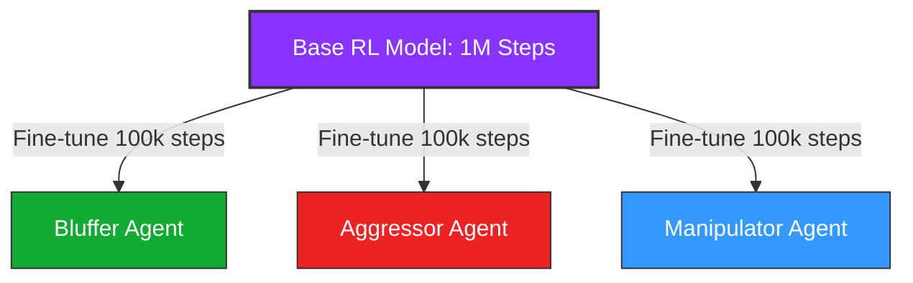

# 🌌 Liar's Bar 3D (Coup) - 3D Digital Game & Reinforcement Learning AI

A visually stunning, high-fidelity 3D digital adaptation of the classic hidden-influence board game **Coup**, heavily inspired by the immersive, smoky, dark-themed tavern aesthetic of *Liar's Bar*. The project features a fully playable React Three Fiber / Three.js front-end, a robust Python game engine, a WebSocket server for human-vs-AI matching, and a highly sophisticated self-play **Reinforcement Learning (RL) AI** trained via MaskablePPO to master deception, bluffing, and psychological warfare.

---

## 📸 Snapshot Gallery

Explore the highly detailed, immersive 3D tavern environment and premium user interface elements:

<table style="width: 100%; border-collapse: collapse; border: none;">
  <tr>
    <td style="width: 50%; padding: 5px; border: none;">
      <p align="center"><strong>3D Tavern Poker Table & Hand View</strong></p>
      
    </td>
    <td style="width: 50%; padding: 5px; border: none;">
      <p align="center"><strong>Interactive Action Selection Modal</strong></p>
      
    </td>
  </tr>
  <tr>
    <td style="width: 50%; padding: 5px; border: none;">
      <p align="center"><strong>Interactive Clue-Style Notes Sheet</strong></p>
      
    </td>
    <td style="width: 50%; padding: 5px; border: none;">
      <p align="center"><strong>Real-time Tavern Logs Archive (Fullscreen)</strong></p>
      
    </td>
  </tr>
</table>

---

## 📁 Repository Directory Structure

Below is a breakdown of the codebase architecture, giving a high-level overview of what each directory contains:

```
COUP/
├── 📂 liars_bar_3d/         # Next.js Front-End (3D UI & Frontend Logic)
│   ├── 📂 src/
│   │   ├── 📂 app/          # Main client entry page, layout definitions, global styling
│   │   ├── 📂 components/   # React & React Three Fiber components (GameScene, GameHUD, Card3D, Table3D)
│   │   └── 📂 hooks/        # React hooks managing local game loop & WebSocket client actions (useCoupState)
│   ├── package.json         # Front-end project scripts and dependencies (three, @react-three/fiber, tailwind)
│   └── tsconfig.json        # TypeScript compile configuration
│
├── 📂 rl_training/          # Python Reinforcement Learning Pipeline & Training scripts
│   ├── 📂 logs/             # Training CSV data logs, 전략 trend analyses, and step reports
│   ├── env.py               # OpenAI Gym / Gymnasium environment wrapper for Coup (rewards, state, masking)
│   ├── train_ppo.py         # MaskablePPO training script with Fictitious Self-Play opponent pool
│   ├── personality_trainer.py # Fine-tuning scripts to craft specialized personalities (Bluffer, Aggressor, Manipulator)
│   ├── evaluate.py          # Benchmark agents (Random, Aggressive, Passive, Rule-Based) & test matchups
│   ├── tournament.py        # Multi-agent round-robin tournament simulator to rank policies
│   ├── explain.py           # Strategic explainability analyzer (decodes decisions and computes actions probability)
│   ├── meta_analyzer.py     # Strategy analyzer (monitors bluff frequency, wins, seat bias)
│   └── observation.py       # Encoder converting raw engine game states to 102-dimensional ML vectors
│
├── 📂 models/               # Stable-Baselines3 neural network checkpoint weight (.zip) files
│   ├── ppo_coup_best.zip          # The historical best agent by mean reward in evaluation matches
│   ├── ppo_coup_final.zip         # The final fully-trained base model weights (1,000,000 steps)
│   ├── ppo_coup_aggressor.zip     # Aggressor personality fine-tuned agent (100k extra steps)
│   ├── ppo_coup_bluffer.zip       # Bluffer personality fine-tuned agent (100k extra steps)
│   ├── ppo_coup_manipulator.zip   # Manipulator personality fine-tuned agent (100k extra steps)
│   └── 📄 ppo_coup_[25k-975k].zip # Step-wise self-play pool snapshots saved every 25,000 steps
│
├── 📂 snapshots/            # High-resolution in-game screenshots and visual assets
│
├── 📂 tests/                # Comprehensive Python pytest suite validating all rules & simulator behaviors
│   ├── test_coup_engine.py  # Standard engine rules tests (Challenges, blocks, flow)
│   ├── test_ai_player.py    # AI player observation encoding and action mapping tests
│   └── test_chaos_and_strategy.py # Fuzz testing and extreme edge case scenarios
│
├── 📂 web_ui/               # Legacy 2D HTML/CSS/JS web interface
│
# Root Level Engine Files
├── coup_engine.py           # Core Coup rules state machine (no illegal transitions allowed)
├── game_state.py            # Holds state schemas (players, cards, coins, turn phases)
├── ai_player.py             # Bridge loading SB3 models in Python to predict actions during WebSocket play
├── server.py                # WebSocket server orchestrating client actions, AI turns, and state synchronization
├── play_vs_ai.py            # Bridge script launching background AI players to connect to the active game server
├── run_training.py          # Unified command-line interface to start or resume RL training
└── requirements.txt         # Core python libraries (stable-baselines3, sb3-contrib, websockets, pytest)
```

---

## 🤖 Deep-Dive: AI Agent Architecture & Training

The Coup AI is not hardcoded; it is a **deep reinforcement learning agent** trained to think, lie, and deduce. In a game of hidden information like Coup, traditional minimax trees fail due to the exponential branching of unrevealed cards and bluffs. Instead, our agent learns optimal probability distributions over actions through **Self-Play Reinforcement Learning**.

### 1. The Algorithm: MaskablePPO
Traditional PPO (Proximal Policy Optimization) struggles in games with tight rulesets because it spends millions of steps sampling "illegal actions" (e.g., trying to Coup with 2 coins, or attempting to block a Steal with a Contessa). 
* We utilize **MaskablePPO** (`sb3_contrib`), which integrates a boolean validity mask directly into the policy head.
* Illegal actions are masked out (assigned $-\infty$ logits) before the agent samples actions during training and inference.
* This ensures $100\%$ valid action selections, allowing the neural network to focus solely on **strategy** and **deception** rather than trying to memorize rules.

### 2. Network Architecture
To represent the complexities of hidden cards, bluffing histories, and dynamic player statuses, a deep custom network is used:
* **Feature Extractor**: A high-capacity Multi-Layer Perceptron (MLP) with shape `[256, 256, 128]`.
* **Layer Depth**: 3 layers. This depth is vital for representing multi-step reasoning, keeping track of what cards have been shown, and building an implicit model of other players' bluffing frequencies.

### 3. Observation Space: The 102-Dimensional State Vector
To make a decision, the AI receives a continuous $102$-dimensional vector encoding the current observable state of the board:
* **Coin Statuses** ($3$ dimensions): Normalized coin count for each player ($coins / 12.0$).
* **Influence Health** ($3$ dimensions): Remaining influences ($health / 2.0$) per player.
* **Survival Indicators** ($3$ dimensions): Binary values indicating which players are still active.
* **Active Player Marker** ($3$ dimensions): One-hot encoding of whose turn it is.
* **Game Stage** ($8$ dimensions): One-hot encoding of the current game stage (Action selection, Challenge window, Block window, Exchange, Card reveal, etc.).
* **Private Hand** ($10$ dimensions): One-hot encoding of the AI's two private cards.
* **Action History Records** ($72$ dimensions): A sliding history of the last $6$ actions taken on the board. Each action records the actor index (one-hot), action type (one-hot), challenge outcome, and block success, giving the model clear temporal memory of who lied and when.

### 4. Self-Play & The Opponent Pool (Fictitious Self-Play)
If an agent only trains against a static heuristic bot, it quickly learns to exploit that specific bot's weaknesses but fails completely against humans or different strategies.
* To prevent strategy collapse, we use **Fictitious Self-Play**.
* The training loop maintains an **Opponent Pool** of up to **8 historical snapshots** of the agent itself (saved every $25,000$ steps) alongside standard heuristic profiles (Aggressive, Rule-Based, and Passive).
* In every parallel environment, the training agent is pitted against random selections from this opponent pool.
* As the agent improves, the opponent pool becomes more challenging, forcing the network to discover generalizable, robust nash-equilibria for bluffing and calling bluffs.

### 5. Base Model Training (1,000,000 Steps)
The base model (`ppo_coup_final.zip`) was trained for **1,000,000 total steps** across **4 parallel environments** (collecting $4096$ steps per update loop).
* **Entropy Coefficient**: Maintained high early on ($0.05$) to force the model to explore risky deception (e.g. stealing without a Captain, tax without a Duke) and challenge aggressively, rather than collapsing into a safe, passive "Income-only" play style.
* **Discount Factor ($\gamma$)**: $0.995$ to ensure that early game actions are evaluated with a high appreciation of final victory or defeat.
* **Learning Rate**: Linearly decayed from $3\times 10^{-4}$ down to $3\times 10^{-5}$ to lock in mature bluffing behaviors as the network converged.

#### 📈 Reward Shaping Matrix (Base Agent)
The basic agent’s objective function is aligned with game success via shaped rewards:
* **Survival Incentive**: $+0.01$ per turn survived (encourages holding onto influence).
* **Coin Efficiency**: $+0.03$ per coin earned through Tax or Steal (encourages active resource hoarding).
* **Block Success**: $+0.05$ (incentivizes blocking attacks and claiming block characters).
* **Opponent Elimination**: $+0.15 \to +0.20$ (rewards successful assassinations and coups).
* **Deception Proofing / Challenge Success**: $+0.15$ (incentivizes calling out bluffs or proving one's own truth).
* **Match Victory/Defeat**: $\pm 1.0$ (final outcome incentive).

---

### 🎭 Personality Fine-Tuning (100,000 Steps Each)
Once the base model achieved grandmaster-level play, it was cloned and fine-tuned for **100,000 additional steps** under custom, highly-skewed reward environments in `rl_training/personality_trainer.py` to create three distinct personality archetypes:



#### 1. 🃏 The Bluffer (`ppo_coup_bluffer.zip`)
Designed to be highly deceptive, opportunistic, and risk-tolerant.
* **Modified Rewards**: Caught-bluffing penalty is halved ($+0.1$ offset), and successful bluffs/truth-proofs receive a massive $+0.25$ bonus. Passive Income actions are penalized ($-0.02$).
* **Playstyle**: Extremely aggressive bluffing. Will regularly claim Duke to tax and Captain to steal, and is highly likely to counter-claim Contessa when assassinated, relying on psychological pressure to force opponents to pass.

#### 2. ⚔️ The Aggressor (`ppo_coup_aggressor.zip`)
Highly offensive, focuses on eliminating other players as rapidly as possible.
* **Modified Rewards**: Coup actions and Assassinations that eliminate players receive a $+0.20$ bonus. Steals are rewarded $+0.07$ per coin (more than double the base rate). Safe Income actions are heavily penalized ($-0.03$), and surviving past turn 25 without any eliminations triggers a $-0.05$ turn-wise penalty.
* **Playstyle**: Aggressive hoarder. Fast-tracks to $7$ or $10$ coins using stealing, then immediately performs Coups or Assassinations. Does not allow games to stagnate.

#### 3. 🧠 The Manipulator (`ppo_coup_manipulator.zip`)
Highly defensive, cautious, and calculating. Focuses on draining opponent resources while playing safe.
* **Modified Rewards**: Successful blocks receive an extra $+0.25$ reward. Inducing opponents to make incorrect challenges against it awards $+0.10$. Hoarding $10$ or more coins before executing a Coup is rewarded $+0.10$.
* **Playstyle**: Highly defensive. Loves to pass challenges but will clamp down on attacks by claiming blocks (Captain/Ambassador/Contessa). Accumulates massive piles of coins quietly and strikes only when victory is guaranteed.

---

## 🎮 How to Run and Play

### Prerequisites
Make sure you have **Python 3.10+** and **Node.js 18+** installed.

### 1. Python Server Setup
Install Python dependencies and start the WebSocket server:
```bash
# Install core dependencies
pip install -r requirements.txt

# Start the WebSocket server
python server.py
```

### 2. Launch AI Bot Opponents
To fill the lobby with trained AI bots (which will connect directly to the WebSocket server):
```bash
# Connects bots to the lobby. They will automatically load 'ppo_coup_best.zip'
python play_vs_ai.py
```

### 3. Front-End Web Application Setup
Open a new terminal window to spin up the 3D Next.js interface:
```bash
# Navigate to front-end folder
cd liars_bar_3d

# Install packages
npm install

# Run local development server
npm run dev
```
Open [http://localhost:3000](http://localhost:3000) in your web browser. 

---

## 🛠️ Key UI Features Implemented

* **3D Tavern Poker Table**: Interactive 3D board utilizing Three.js/React Three Fiber with custom warm table lighting, shadows, and dynamic cameras.
* **Spotlight Tracker**: A glowing spotlight shifts in real-time to focus on whoever is taking their turn, indicating who they are targeting or challenging.
* **Interactive Clue Notes Drawer**: Click the floating `📝 Clue Notes` tab on the left. Toggle cell markers (`✓`, `✗`, `?`) to track public card distributions, discards, and deduce the opponent's private cards just like Cluedo.
* **Scrollable Tavern Logs**: Real-time logging of actions, challenges, and card reveals. Clicking the Tavern Log widget expands it into a **fullscreen historical archive** modal to trace the full history of the game.
* **Keyboard Fullscreen Toggles**: Press `F` or `f` at any time to toggle fullscreen mode safely (ignoring keypresses when typing in inputs).
* **Audio Feedback**: Features synthesized Web Audio API applause on game-over victory, and a premium sweep synthesizer when returning to the game lobby.
* **Taskbar & Screen Safety**: All interactive buttons are lifted by a minimum of `pb-16` (56px) to avoid taskbar overlaps, and pointer-lock rejections are caught gracefully.

---

## 🧪 Running Automated Tests

Run the complete suite of tests to verify game rules, challenge mechanics, and model evaluation routines:
```bash
# Run all unit tests
pytest

# Run comprehensive grading scripts
python tests/run_comprehensive_grading.py
```
All 56 unit and scenario tests are designed to pass, ensuring a production-grade, bug-free implementation.

---

## 🤝 Git Push Guide (GitHub Setup)

To push this repository to your own GitHub, run the following commands in your shell:

```bash
# Add all files to staging (including models and snapshots)
git add .

# Create the initial commit
git commit -m "feat: complete 3D Liar's Bar Coup with 1M-step Self-Play RL AI and Clue Notes"

# Rename branch to main
git branch -M main

# Add your GitHub remote repository (replace with your repo URL)
git remote add origin https://github.com/YOUR_USERNAME/YOUR_REPO_NAME.git

# Push changes to GitHub
git push -u origin main
```
*(Note: If you have large models exceeding 100MB, consider tracking them using Git LFS, but the provided trained checkpoints are highly optimized at ~3.4MB and can be pushed safely directly via Git).*
